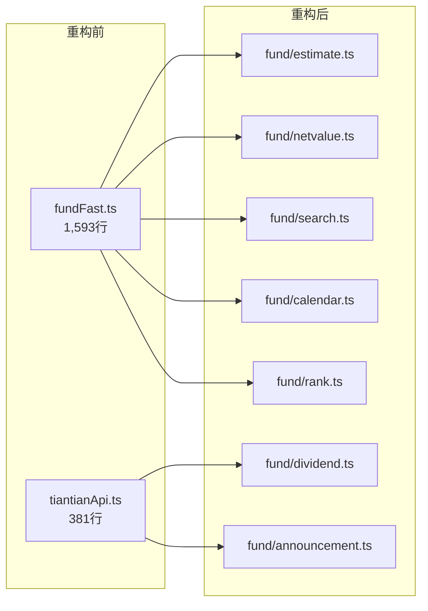

# millionFund 基金模块分析与改进路线图

**版本**: v0.1-draft  
**最后更新**: 2026-07-02  
**维护者**: ghshhf  
**状态**: 🟢 持续维护

---

> 本文档聚焦基金模块的技术分析、改进计划和功能增强路线。  
> 基金是百万资产的**核心品类**，当前代码量最大、数据源最丰富，也积累了不少技术债。

---

## 目录

1. [模块全景](#一模块全景)
2. [代码诊断](#二代码诊断)
3. [已知问题清单](#三已知问题清单)
4. [改进路线图](#四改进路线图)
5. [版本规划](#五版本规划)
6. [附录：数据流详解](#六附录数据流详解)

---

## 一、模块全景

### 1.1 代码规模统计

| 模块 | 文件 | 行数 | 功能 |
|------|------|------|------|
| **核心 API** | `api/fundFast.ts` | 1,593 | 估值、净值、搜索、批量请求、缓存 |
| **增强 API** | `api/tiantianApi.ts` | 381 | 交易日判断、阶段涨幅、分红、公告、费率 |
| **HTTP 请求** | `api/fund/request.ts` | 358 | 并发控制、JSONP 解析、串行队列 |
| **统一缓存** | `api/unifiedCache.ts` | 305 | 双层缓存（内存 + localStorage） |
| **基础缓存** | `api/cache.ts` | — | 内存缓存 + TTL |
| **Store** | `stores/holding.ts` | 765 | 持仓 CRUD、盈亏计算、筛选排序 |
| **Store** | `stores/fund.ts` | 231 | 自选基金列表、批量估值刷新 |
| **行情** | `api/eastmoney.ts` | — | 东方财富行情（辅助） |
| **源配置** | `config/sources.ts` | — | 基金来源配置（支付宝/腾讯/京东） |
| **合计** | **~10 个文件** | **~3,700 行** | |

### 1.2 当前功能矩阵

| 功能 | 状态 | 详细说明 |
|------|------|---------|
| **实时估值** | ✅ | 天天基金 API，盘中估值 + 收盘净值 |
| **历史净值** | ✅ | 支持 30/60/90/180/365/400 天 |
| **基金搜索** | ✅ | 代码/名称/拼音模糊搜索 |
| **批量刷新** | ✅ | 并行 5 个请求的 ConcurrencyController |
| **基金详情** | ✅ | 分时图、净走势、持仓分析、同类排名 |
| **阶段涨幅** | ✅ | 近 1 周/1 月/3 月/6 月/1 年 |
| **分红记录** | ✅ | 独立组件 `DividendRecordsSection.vue` |
| **基金公告** | ✅ | 独立组件 `FundAnnouncementsSection.vue` |
| **持仓分析** | ✅ | 资产配置、持有人结构、风格分析 |
| **重仓股** | ✅ | 组件 `TopHoldingsPopup.vue` |
| **趋势预测** | ✅ | 组件 `TrendPredictionSection.vue`（均线/支撑阻力） |
| **交易记录** | ✅ | 买入/卖出/分红/定投 CRUD |
| **AI 调仓追踪** | ✅ | 调仓记录 + 成功率统计 |
| **涨跌提醒** | ✅ | 阈值触发 + 弹窗通知 |
| **多数据源** | ✅ | 支持 3 个来源（支付宝/腾讯/京东）分类筛选 |
| **OCR 截图导入** | ✅ | Tesseract.js（待改进，详见 `FUTURE_ROADMAP.md`） |
| **公告时间线** | ❌ | 当前仅列表展示，无时间线视图 |
| **基金对比** | ❌ | 不支持多基金横向对比 |
| **定投计算器** | ❌ | 不支持定投收益模拟 |
| **基金筛选器** | ❌ | 不支持按类型/收益率/风险等级筛选 |

### 1.3 数据流架构

```
用户操作
  │
  ▼
┌──────────┐    ┌──────────┐    ┌──────────┐
│ Home.vue │    │Detail.vue│    │Holding.vue│
│ (自选)   │    │ (详情)   │    │ (持仓)   │
└────┬─────┘    └────┬─────┘    └────┬─────┘
     │               │               │
     ▼               ▼               ▼
┌─────────────────────────────────────────┐
│           Pinia Store 层                  │
│  ┌──────────┐    ┌──────────┐          │
│  │ fund.ts  │    │holding.ts│          │
│  │ (自选)   │    │ (持仓)   │          │
│  └────┬─────┘    └────┬─────┘          │
└───────┼───────────────┼────────────────┘
        │               │
        ▼               ▼
┌─────────────────────────────────────────┐
│           API 数据层                      │
│  ┌──────────────┐  ┌────────────────┐   │
│  │ fundFast.ts  │  │ tiantianApi.ts │   │
│  │ (估值/净值/搜)│  │ (交易日/阶段 ) │   │
│  └──────┬───────┘  └───────┬────────┘   │
│         │                  │            │
│         ▼                  ▼            │
│  ┌──────────────────────────────────┐   │
│  │       缓存层                      │   │
│  │  cache.ts + unifiedCache.ts      │   │
│  │  (内存 TTL + localStorage 持久) │   │
│  └──────────────┬───────────────────┘   │
│                 │                       │
│                 ▼                       │
│  ┌──────────────────────────────────┐   │
│  │       HTTP 请求层                 │   │
│  │  fund/request.ts + http.ts       │   │
│  │  (并发控制5 / 串行队列 / 正则解) │   │
│  └──────────────┬───────────────────┘   │
└─────────────────┼───────────────────────┘
                  │
                  ▼
        天天基金 / 东方财富
         公开 HTTP/JSONP 接口
```

---

## 二、代码诊断

### 2.1 fundFast.ts 内部结构（1,593 行）

| 函数/区域 | 行号 | 行数 | 复杂度 | 说明 |
|-----------|------|------|--------|------|
| `clearFundCache / clearAllCache` | 18-35 | 18 | 🟢 | 缓存清理 |
| `ConcurrencyController` 实例化 | 38 | 1 | 🟢 | 并发5 |
| `queueGlobalVarScript` | 56-120 | 65 | 🟡 | 串行队列（JSONP 污染防护） |
| `fetchFundEstimate` | ~130-180 | 50 | 🟢 | 获取单基金实时估值 |
| `fetchBatchFundEstimate` | ~190-280 | 90 | 🟡 | 批量获取估值 |
| `fetchFundNetValueHistory` | ~300-450 | 150 | 🟡 | 历史净值 + 沪深300对比 |
| `searchFund` | ~470-550 | 80 | 🟢 | 基金搜索 |
| `fetchFundList` | ~570-650 | 80 | 🟡 | 全量基金列表 |
| `fetchFundEstimateBatch` | ~670-800 | 130 | 🟡 | 另一种批量入口 |
| `fetchTradingCalendar` | ~820-900 | 80 | 🟢 | 交易日历 |
| 工具函数 | ~920-1100 | 180 | 🟡 | 解析、格式、降级 |
| `fetchLatestNetValue` | ~1120-1200 | 80 | 🟢 | 最新净值 |
| 阶段涨幅/排名 | ~1220-1400 | 180 | 🟠 | 含多段逻辑 |
| 剩余辅助函数 | ~1420-1593 | 173 | 🟡 | 导出/缓存/重试 |

### 2.2 holding.ts Store 诊断（765 行）

| 区域 | 功能 | 行数 | 评估 |
|------|------|------|------|
| State 定义 | 持仓列表、筛选状态、汇总 | 50 | ✅ 清晰 |
| Getter | 按类别/来源筛选、盈亏计算 | 180 | 🟡 有重复计算 |
| Action: CRUD | addOrUpdateHolding / removeHolding | 120 | ✅ 有去重和校验 |
| Action: 净值更新 | 批量更新所有持仓当前净值 | 150 | 🟠 依赖多个 API 调用 |
| Action: 导入/导出 | CSV 导出 | 80 | ✅ |
| Action: 汇总计算 | totalValue/profit/today profit | 185 | 🟠 计算逻辑和 UI 耦合 |

### 2.3 关键视图组件规模

| 组件 | 行数 | 诊断 |
|------|------|------|
| `Home.vue` | 3,251 | 🔴 过大，建议拆分为 5-8 个子组件 |
| `Detail.vue` | 2,363 | 🟠 已部分拆分（趋势/分红/公告独立），剩余仍多 |
| `Holding.vue` | 2,325 | 🟠 持仓列表 + 汇总 + 筛选混合 |
| `FundCard.vue` | — | ✅ 已独立 |
| `ScreenshotImport.vue` | 825 | 🟠 逻辑偏重，建议拆分 composable |

---

## 三、已知问题清单

### 🔴 P0 — 阻塞性

| # | 问题 | 位置 | 原因 | 修复方案 |
|---|------|------|------|---------|
| F-01 | Home.vue 3,251 行 | 单文件过大 | 自选列表 + 估值刷新 + 市场概览 + 资讯聚合全部在一个文件 | 拆为 HomeContainer + WatchlistSection + MarketOverview + NewsFlash 等子组件 |

### 🟠 P1 — 高优先级

| # | 问题 | 位置 | 原因 | 修复方案 |
|---|------|------|------|---------|
| F-02 | fundFast.ts 1,593 行 | "万能"API 文件 | 初期快速增长导致，职责边界模糊 | 按功能域拆分（见 §4.1） |
| F-03 | CSV 导出依赖 fundFast 类型 | `holding.ts:action` | `fetchLatestNetValue` 返回值不统一 | 统一净值返回类型，添加错误处理 |
| F-04 | 非交易时间无友好提示 | `Home.vue` | 估值为 `--` 时不明确提示原因 | 添加交易时段状态栏 |
| F-05 | QDII 基金估值不准确 | `fundFast.ts` | QDII 净值更新延迟 1-3 天，当前仍按 A 股规则计算 | 添加 `isQDII` 标记 + 延迟更新逻辑 |
| F-06 | 缓存键冲突风险 | `unifiedCache.ts` | `estimate_${code}` 和 `netvalue_${code}` 在切换 TTL 时可能读旧 | 缓存键加入 TTL 版本号或时间戳 |

### 🟡 P2 — 中等优先级

| # | 问题 | 说明 |
|---|------|------|
| F-07 | 自选列表不支持拖拽排序 | 当前按添加顺序排列 |
| F-08 | 基金详情页缺少同类型基金对比 | 查看某基金时无法快速对比同类 |
| F-09 | 阶段涨幅数据无缓存过期指示 | 用户可能看到的是数小时前的数据 |
| F-10 | 基金搜索不支持模糊拼音 | 当前模糊匹配效果有限 |
| F-11 | 持仓编辑体验差 | 修改份额/成本后需手动保存，无草稿机制 |
| F-12 | 基金来源分类硬编码 | `config/sources.ts` 中 3 个来源固定，扩展需改代码 |

### 🟢 P3 — 锦上添花

| # | 问题 | 说明 |
|---|------|------|
| F-13 | 基金详情页无 "分享持仓" | 无法截图分享给朋友 |
| F-14 | 无基金收藏夹 | 自选之外还想收藏观察列表 |
| F-15 | 历史净值走势无对数坐标 | 长期数据显示线性 vs 对数可切换 |
| F-16 | 无定投日历视图 | 定投日一目了然 |

---

## 四、改进路线图

### 4.1 代码重构 — fundFast.ts 拆分计划

当前 1,593 行的 `fundFast.ts` 建议拆分为：

```
src/api/fund/
├── index.ts              # 统一导出，保持向后兼容
├── estimate.ts           # 实时估值（fetchFundEstimate / fetchBatchFundEstimate）
├── netvalue.ts           # 历史净值（fetchFundNetValueHistory / fetchLatestNetValue）
├── search.ts             # 搜索（searchFund / fetchFundList）
├── calendar.ts           # 交易日历（fetchTradingCalendar）
└── rank.ts               # 阶段涨幅/排名（fetchPeriodReturn / fetchRank）
```

同时：

- **`src/api/tiantianApi.ts`** → 保留交易日判断，分红/公告/费率移到 `fund/` 目录
- **`stores/fund.ts`** → 只保留自选管理（增删改查），估值刷新移到 composable



### 4.2 功能增强

#### 4.2.1 基金对比工具（P1）

```typescript
// 新增 composable: useFundComparison
interface FundComparisonItem {
  code: string
  name: string
  // 收益对比
  returns: {
    '1周': number
    '1月': number
    '3月': number
    '6月': number
    '1年': number
    '今年来': number
  }
  // 风险指标
  maxDrawdown: number  // 最大回撤
  volatility: number   // 波动率
  sharpe: number       // 夏普比率
  // 持仓对比
  topHoldings: string[]  // 重仓股
  assetAllocation: { stock: number; bond: number; cash: number }
}
```

- 详情页 → 点击"对比" → 弹出对比面板
- 支持 2-5 只基金横向对比（收益曲线叠加、持仓对比表）
- 使用 Lightweight Charts 多系列叠加

#### 4.2.2 基金筛选器（P1-P2）

```typescript
// 新增视图: FundScreener.vue
interface FundFilterCriteria {
  type: string[]          // 股票型/混合型/债券型/指数型/货币型/QDII
  fundCompany?: string    // 基金公司
  manager?: string        // 基金经理
  sortBy: 'return' | 'risk' | 'rating'
  sortOrder: 'asc' | 'desc'
  dateRange: '1周' | '1月' | '3月' | '6月' | '1年'
  minRating?: number      // 晨星评级 ≥
  maxDrawdown?: number    // 最大回撤 ≤
  scale?: 'less1e' | '1e-10e' | '10e-50e' | '50e+'  // 规模
}
```

- 数据来源：天天基金公开 API（已有接口）
- 交互：类似筛选器的条件面板，实时预览结果
- 性能：服务端分页，前端只缓存最近浏览的 50 条

#### 4.2.3 定投模拟器（P2）

```typescript
// 新增 composable: useDcaSimulator
interface DcaPlan {
  fundCode: string
  amount: number          // 每期定投金额
  frequency: 'weekly' | 'biweekly' | 'monthly'
  startDate: string
  endDate: string
}

interface DcaResult {
  totalInvested: number   // 总投入
  currentValue: number    // 当前市值
  totalReturn: number     // 总收益
  totalReturnRate: number // 总收益率
  avgCost: number         // 平均成本
  transactions: {         // 每笔定投明细
    date: string
    nav: number           // 当日净值
    shares: number        // 购入份额
    cost: number          // 金额
  }[]
}
```

- 使用历史净值数据回测
- 可视化：累计投入 vs 市值曲线
- 对比一次性买入 vs 定投的效果

#### 4.2.4 QDII 基金支持增强（P1）

| 改进点 | 当前 | 目标 |
|--------|------|------|
| 净值更新时间 | 按 A 股交易时间刷新 | 根据 QDII 基金的实际净值公布时间（T+1/T+2） |
| 汇率影响 | 忽略 | 加入离岸人民币汇率修正 |
| 涨跌幅计算 | 当日估值 | 使用最新公布净值 + 隔夜估值 |
| 时区显示 | 北京时间 | 显示对应市场时间（美股晚间/港股下午） |

#### 4.2.5 增强型基金详情页 UI（P2）

当前 `Detail.vue` 已拆分出趋势/分红/公告独立组件。下一步：

```
┌─────────────────────────────────────┐
│  基金名称 + 代码 + 类型标签         │
│  ───────────────                    │
│  实时估值: 1.2345 (+0.89%)         │
│  昨收净值: 1.2345 (2024-01-30)     │
│  ───────────────                    │
│  [分时图]  [日K]  [周K]  [月K]    │  ← 新增K线切换
│  ┌─────────────────────────┐       │
│  │   净值走势图 (可选沪深300) │       │
│  └─────────────────────────┘       │
│  ───────────────                    │
│  📊 阶段涨幅  (比同类)             │  ← 新增同类平均对比
│  近1周 +2.3%  (同类 +1.5%)        │
│  近1月 +5.6%  (同类 +4.2%)        │
│  ───────────────                    │
│  🏆 同类排名                        │  ← 新增排名条
│  近1年: 45/1256  (前4%)            │
│  ───────────────                    │
│  [持仓分析] [重仓股] [基金经理]    │
│  [分红记录] [基金公告] [费率]     │
│  ───────────────                    │
│  [加入自选]  [对比]  [定投模拟]   │  ← 新增操作按钮
└─────────────────────────────────────┘
```

### 4.3 性能优化

| # | 优化项 | 当前 | 目标 |
|---|--------|------|------|
| P-01 | 自选列表首次加载 | 串行请求每只基金估值 | 批量估值接口 + 缓存优先渲染 |
| P-02 | 持仓页面汇总计算 | 每次进入重新计算 | 增量更新 + 缓存最后汇总结果 |
| P-03 | 历史净值请求 | 每次请求完整数据 | 增量请求（仅获取缺失天数） |
| P-04 | 搜索响应速度 | 远程请求 | 本地构建拼音索引 + 记忆最近搜索 |
| P-05 | 基金列表内存占用 | 全量列表存内存（~15,000 条） | 虚拟滚动 + 懒加载 |

### 4.4 测试增强

| # | 测试目标 | 当前覆盖 | 目标覆盖 |
|---|---------|---------|---------|
| T-01 | 估值解析 | 基础 mock | 真实 JSONP 响应 + 边界值（空字符串、负数） |
| T-02 | 历史净值计算 | 部分 | 日期排序、缺失值填补、沪深300对齐 |
| T-03 | 持仓盈亏计算 | 基础 | 多币种、分红再投资、多次买入均价 |
| T-04 | 交易日判断 | 基础 | 动态节假日、调休、半天交易 |
| T-05 | 批量请求并发控制 | 无 | 5 并发测试、超时重试、全失败回退 |
| T-06 | E2E 搜索 + 添加基金 | 有（18 用例） | 补充：搜索无结果、添加重复、网络断开 |

真实测试数据准备：

```
tests/fixtures/api/
├── fund-estimate.json         # 实时估值真实响应
├── fund-netvalue.json         # 历史净值真实响应 (400天)
├── fund-search-results.json   # 搜索结果
├── fund-list.json             # 全量基金列表（摘录前100条）
├── qdii-estimate.json         # QDII 基金估值
└── trading-calendar.json      # 交易日历
```

---

## 五、版本规划

### v1.10.x — "基金重构"（2 周）

| 任务 | 类型 | 工时 | 优先级 | 依赖 |
|------|------|------|--------|------|
| fundFast.ts 拆分（5-7 个模块） | 🏗 重构 | 2d | P1 | — |
| tiantianApi.ts 职责清理（分红/公告迁移） | 🏗 重构 | 1d | P1 | — |
| Home.vue 组件拆分（3,251 → 5 个子组件） | 🏗 重构 | 2d | P1 | — |
| 缓存键冲突修复（版本化缓存键） | 🐛 修复 | 4h | P1 | — |
| QDII 基金判 + 延迟更新逻辑 | ✨ 功能 | 1d | P1 | — |
| 非交易时间状态栏 | ✨ 功能 | 4h | P2 | — |
| 基金 API 真实响应测试集 | 🧪 测试 | 1d | P1 | 拆分完成后 |

### v1.11.x — "基金功能增强"（2-3 周）

| 任务 | 类型 | 工时 | 优先级 | 依赖 |
|------|------|------|--------|------|
| 基金对比工具（2-5 只横向对比） | ✨ 功能 | 2d | P1 | 阶段涨幅 API |
| 基金筛选器（类型/收益率/风险） | ✨ 功能 | 2d | P1 | 基金列表 + 排名 API |
| 详情页同类平均对比 | ✨ 功能 | 1d | P2 | 阶段涨幅 API |
| 自选列表拖拽排序 | ✨ 功能 | 1d | P2 | — |
| 搜索增强（拼音 + 最近搜索记忆） | ✨ 功能 | 1d | P2 | — |
| 基金来源配置可扩展 | 🏗 重构 | 4h | P2 | — |

### v2.0.x — "基金高级工具"（4-6 周）

| 任务 | 类型 | 工时 | 优先级 | 依赖 |
|------|------|------|--------|------|
| 定投模拟器（历史回测 + 可视化） | ✨ 功能 | 3d | P2 | 历史净值 API |
| 基金详情页 K线切换（日/周/月） | ✨ 功能 | 2d | P2 | 净值数据 |
| 持仓页面增量汇总计算 | 🚀 性能 | 1d | P2 | — |
| 批量估值增量更新 | 🚀 性能 | 2d | P1 | — |
| E2E 测试补全（搜索/添加/删除/网络异常） | 🧪 测试 | 2d | P1 | — |
| 基金收藏夹（独立于自选） | ✨ 功能 | 1d | P3 | — |

---

## 六、附录：数据流详解

### 6.1 实时估值流程

```
用户打开 Home.vue
  │
  ▼
fundStore.fetchAllEstimates()
  │
  ▼
fundFast.fetchBatchFundEstimate(codes[])
  │  ├─ cache.get('estimate_batch_${codes.join()}') → 命中则直接返回
  │  └─ 未命中 → 并发控制 (ConcurrencyController, max=5)
  │       │
  │       ▼
  │  对每个 code 调用:
  │  fetchFundEstimate(code)
  │    ├─ 构造 URL: https://fundgz.1234567.com.cn/js/${code}.js
  │    ├─ fetch() → 响应文本 (JSONP 格式)
  │    ├─ parseJsVariable('jsonpgz', text) → 提取 FundEstimate
  │    ├─ 正则解析各个字段（防 JSONP 名称变更）
  │    └─ cache.set('estimate_${code}', data, CACHE_TTL.ESTIMATE)
  │
  ▼
返回 Map<string, FundEstimate>
  │
  ▼
fundStore.setEstimates(estimates)
  │
  ▼
Home.vue 重新渲染
```

### 6.2 历史净值流程（含沪深300对比）

```
用户打开 Detail.vue → 切换到净值走势 Tab
  │
  ▼
fundFast.fetchFundNetValueHistory(code, days=365)
  │
  ├─ cache.get('netvalue_${code}_${days}') → 命中直接返回
  │
  ├─ 未命中:
  │    ├─ queueGlobalVarScript(pingzhongdata_url, extract, cleanup)
  │    │    ├─ fetch pingzhongdata/*.js (全局变量脚本)
  │    │    ├─ 等待脚本加载完成
  │    │    ├─ 从 window.Data_netWorthTrend 提取净值数据
  │    │    ├─ 清理全局变量 (delete window.Data_netWorthTrend)
  │    │    └─ 返回解析后的 NetValueRecord[]
  │    │
  │    ├─ 同时获取沪深300净值 (fetchFundNetValueHistory('000300', days))
  │    │
  │    └─ cache.set('netvalue_${code}_${days}')
  │
  ▼
返回 { records: NetValueRecord[], hs300Records: NetValueRecord[] }
  │
  ▼
Detail.vue 使用 Lightweight Charts 渲染双线走势图
```

### 6.3 持仓盈亏计算

```
用户打开 Holding.vue
  │
  ▼
holdingStore.loadHoldings()
  │
  ├─ 从 localStorage 读取 HoldingRecord[]
  │
  ▼
holdingStore.refreshAllNetValues()
  │
  ├─ 去重 codes → fundFast.fetchBatchFundEstimate(uniqueCodes)
  │
  ├─ 对每个持仓:
  │    ├─ currentNetValue = estimate.gsz || estimate.dwjz
  │    ├─ currentValue = currentNetValue × shares
  │    ├─ costValue = buyNetValue × shares
  │    ├─ profit = currentValue - costValue
  │    ├─ profitRate = profit / costValue × 100%
  │    ├─ todayProfit = (currentNetValue - prevClose) × shares
  │    └─ holdingDays = today - buyDate
  │
  ▼
汇总:
  ├─ totalValue = sum(currentValue)
  ├─ totalCost = sum(costValue)
  ├─ totalProfit = sum(profit)
  ├─ totalProfitRate = totalProfit / totalCost × 100%
  └─ todayProfit = sum(todayProfit)
```

---

## 更新记录

| 日期 | 版本 | 变更内容 | 作者 |
|------|------|---------|------|
| 2026-07-02 | v0.1 | 初稿：基金模块全景诊断 + 改进路线图 | ghshhf |
| — | — | 待补充 | — |

---

> 📝 **使用说明**：
> - 完成任务后 `[ ]` → `[x]`
> - 新增想法按优先级插入对应章节，标注 P0-P3
> - 大版本发布后清理已完成条目到 CHANGELOG.md
> - 代码重构完成后更新数据流图和代码规模统计
