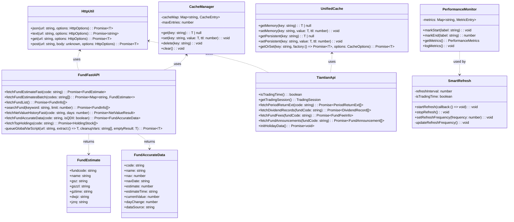
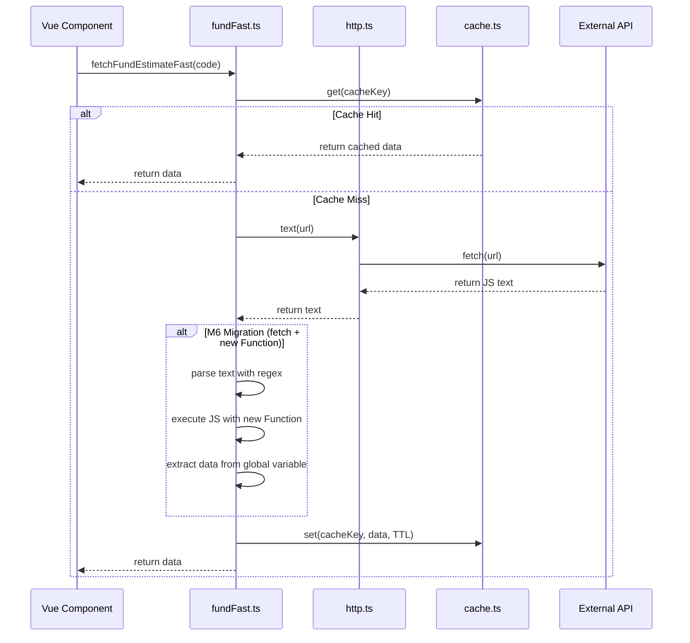
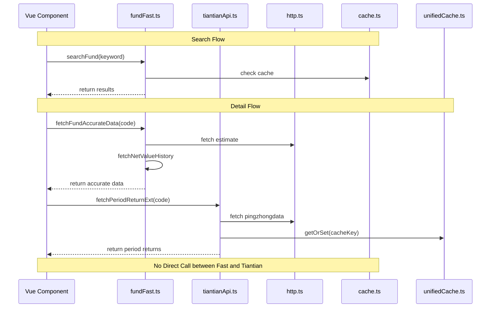
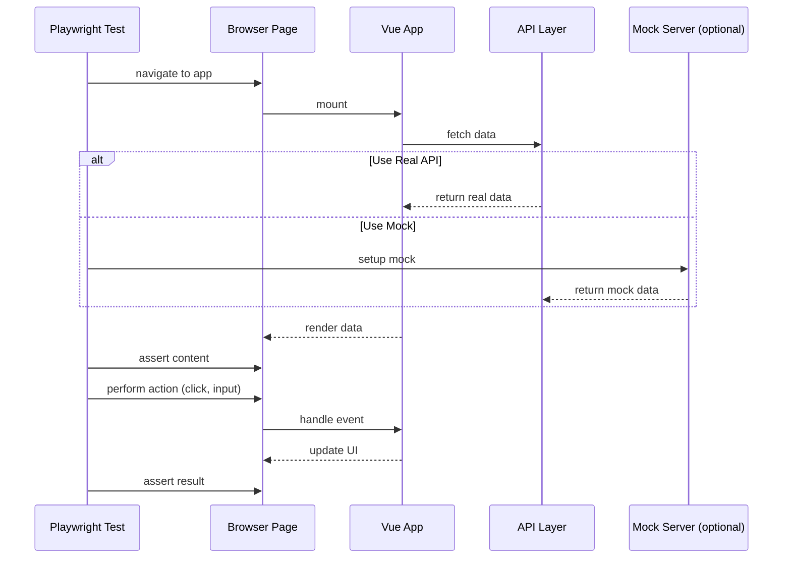

# 百万基金（millionFund）改进架构设计文档

**文档版本**: v1.0  
**创建日期**: 2025-01-15  
**架构师**: 高见远  
**项目**: millionFund 跨平台基金管理系统

---

## 1. 实现方案 + 框架选型

### 1.1 M6 迁移方案

**目标**: 完全移除 JSONP 降级代码，统一使用 `http.text() + new Function`

**实现策略**:
- 保留 `queueGlobalVarScript()` 作为核心工具函数（已正确使用 fetch + new Function）
- 移除 3 个函数中的 JSONP 降级逻辑：
  - `fetchFundList()` - 移除脚本注入 fallback
  - `fetchFundBasicInfo()` - 移除脚本注入 fallback  
  - `fetchGlobalIndices()` - 移除脚本注入 fallback
- 错误处理：请求失败时返回持久化缓存或空结果，不回退到 JSONP

**技术理由**:
- JSONP 存在 XSS 风险，且需要动态脚本注入，代码复杂
- `http.text() + new Function` 使用现代 fetch API，更安全、可维护
- 项目已通过 Vite 代理或直连外部 API，CORS 问题已解决

### 1.2 API 层架构设计

**职责划分**:

| 模块 | 职责 | 包含功能 |
|------|------|----------|
| `fundFast.ts` | 优化版基金 API | 估值、历史净值、搜索、批量请求、并发控制、缓存管理 |
| `tiantianApi.ts` | 天天基金专有功能 | 交易日判断、阶段涨幅、费率、分红、公告、节假日数据 |
| `http.ts` | 公共 HTTP 请求模块 | fetch 封装、超时、重试、错误处理 |
| `cache.ts` | 内存缓存模块 | TTL 过期、最大条目、LRU 淘汰 |
| `unifiedCache.ts` | 统一缓存（内存+持久化） | 双层缓存、localStorage 持久化 |

**架构原则**:
- `fundFast.ts` 和 `tiantianApi.ts` 不允许直接互相调用，必须通过公共模块
- 所有 HTTP 请求通过 `http.ts` 统一发出
- 所有缓存操作通过 `cache.ts` 或 `unifiedCache.ts` 统一管理

### 1.3 E2E 测试框架

**选型**: Playwright（已安装在项目中）

**测试策略**:
- 使用真实 API（关键流程）+ Mock Server（边缘场景）
- 测试覆盖 4 个核心流程：
  1. 基金搜索流程
  2. 基金添加流程
  3. 基金详情查看流程
  4. 实时估值刷新流程

**技术实现**:
- 使用 Playwright Test 框架
- 页面对象模式（Page Object Model）封装页面操作
- 截屏失败时自动保存

### 1.4 性能监控方案

**监控指标**:
- 估值刷新频率（实际 vs 预期）
- 关键操作耗时（使用 `performance.now()`）
- 并发请求数量
- 缓存命中率

**实现方式**:
- 在控制台输出性能日志（不发送到服务端，避免隐私问题）
- 添加 `@vue/devtools-api` 集成，方便开发调试
- 生成性能报告（Markdown 格式）

### 1.5 智能节流与并发控制

**节流策略**:
- 交易时间：刷新频率 3 秒
- 非交易时间：停止自动刷新

**并发控制**:
- 最大并发请求数：5 个
- 使用队列管理请求，避免浏览器限制
- 全局变量型脚本请求串行化（已通过 `queueGlobalVarScript` 实现）

---

## 2. 文件列表及相对路径

### 2.1 修改的文件

| 文件路径 | 用途 | 修改内容 |
|---------|------|----------|
| `src/api/fundFast.ts` | 基金快速 API | 移除 3 处 JSONP 降级代码 |
| `src/api/tiantianApi.ts` | 天天基金 API | 明确职责边界，移除与 fundFast 重叠功能 |
| `src/utils/http.ts` | HTTP 请求工具 | 无需修改（已完善） |
| `src/api/cache.ts` | 内存缓存模块 | 无需修改（已完善） |
| `src/api/unifiedCache.ts` | 统一缓存模块 | 无需修改（已完善） |

### 2.2 新增的文件

| 文件路径 | 用途 |
|---------|------|
| `tests/e2e/fund-search.spec.ts` | 基金搜索流程 E2E 测试 |
| `tests/e2e/fund-add.spec.ts` | 基金添加流程 E2E 测试 |
| `tests/e2e/fund-detail.spec.ts` | 基金详情查看流程 E2E 测试 |
| `tests/e2e/fund-refresh.spec.ts` | 实时估值刷新流程 E2E 测试 |
| `tests/e2e/pages/FundPage.ts` | 页面对象模型（搜索页） |
| `tests/e2e/pages/HomePage.ts` | 页面对象模型（首页） |
| `tests/e2e/pages/DetailPage.ts` | 页面对象模型（详情页） |
| `playwright.config.ts` | Playwright 配置文件 |
| `src/utils/performance.ts` | 性能监控工具 |
| `src/composables/useSmartRefresh.ts` | 智能刷新 composable |
| `docs/performance-report.md` | 性能优化报告 |

### 2.3 文件结构图

```
millionFund/
├── src/
│   ├── api/
│   │   ├── fundFast.ts          # 优化版基金 API（修改）
│   │   ├── tiantianApi.ts       # 天天基金专有功能（修改）
│   │   ├── cache.ts             # 内存缓存（不修改）
│   │   ├── unifiedCache.ts      # 统一缓存（不修改）
│   │   └── fund/
│   │       └── request.ts       # HTTP 请求工具（不修改）
│   ├── utils/
│   │   ├── http.ts             # HTTP 封装（不修改）
│   │   ├── performance.ts      # 性能监控（新增）
│   │   └── logger.ts          # 日志工具（不修改）
│   ├── composables/
│   │   └── useSmartRefresh.ts  # 智能刷新（新增）
│   └── ...
├── tests/
│   └── e2e/
│       ├── fund-search.spec.ts  # 搜索流程测试（新增）
│       ├── fund-add.spec.ts     # 添加流程测试（新增）
│       ├── fund-detail.spec.ts  # 详情流程测试（新增）
│       ├── fund-refresh.spec.ts # 刷新流程测试（新增）
│       └── pages/
│           ├── FundPage.ts      # 搜索页 POM（新增）
│           ├── HomePage.ts      # 首页 POM（新增）
│           └── DetailPage.ts   # 详情页 POM（新增）
├── playwright.config.ts         # Playwright 配置（新增）
└── docs/
    └── performance-report.md   # 性能报告（新增）
```

---

## 3. 数据结构和接口（类图）



---

## 4. 程序调用流程（时序图）

### 4.1 M6 迁移后的基金数据获取流程



### 4.2 API 层调用关系



### 4.3 E2E 测试流程



---

## 5. 任务列表（有序、含依赖关系）

### 任务分解原则
- 按实现顺序排列（先 P0，再 P1，最后 P2）
- 明确依赖关系
- 每个任务粒度适中（1-4 小时）
- 标注涉及的文件路径

### 任务列表表格

| 任务 ID | 任务描述 | 优先级 | 依赖任务 | 估计工作量（小时） | 涉及文件 |
|---------|---------|--------|----------|-------------------|----------|
| **T001** | 移除 `fetchFundList()` 中的 JSONP 降级代码 | P0 | 无 | 1 | `src/api/fundFast.ts` |
| **T002** | 移除 `fetchFundBasicInfo()` 中的 JSONP 降级代码 | P0 | 无 | 1 | `src/api/fundFast.ts` |
| **T003** | 移除 `fetchGlobalIndices()` 中的 JSONP 降级代码 | P0 | 无 | 1 | `src/api/fundFast.ts` |
| **T004** | 明确 `fundFast.ts` 和 `tiantianApi.ts` 职责边界，移除重叠代码 | P0 | T001~T003 | 2 | `src/api/fundFast.ts`, `src/api/tiantianApi.ts` |
| **T005** | 添加性能监控工具 `src/utils/performance.ts` | P1 | 无 | 2 | `src/utils/performance.ts` |
| **T006** | 实现智能刷新 composable `useSmartRefresh.ts` | P1 | T005 | 3 | `src/composables/useSmartRefresh.ts` |
| **T007** | 配置 Playwright 测试环境 | P1 | 无 | 1 | `playwright.config.ts`, `package.json` |
| **T008** | 实现页面对象模型（POM） | P1 | T007 | 2 | `tests/e2e/pages/*.ts` |
| **T009** | 添加基金搜索流程 E2E 测试 | P1 | T008 | 2 | `tests/e2e/fund-search.spec.ts` |
| **T010** | 添加基金添加流程 E2E 测试 | P1 | T009 | 2 | `tests/e2e/fund-add.spec.ts` |
| **T011** | 添加基金详情查看流程 E2E 测试 | P1 | T010 | 2 | `tests/e2e/fund-detail.spec.ts` |
| **T012** | 添加实时估值刷新流程 E2E 测试 | P1 | T011 | 2 | `tests/e2e/fund-refresh.spec.ts` |
| **T013** | 生成性能报告 | P1 | T005~T006 | 2 | `docs/performance-report.md` |
| **T014** | 实现 AI 调仓算法规则引擎（初期） | P2 | T004 | 4 | `src/api/aiPortfolio.ts`, `src/types/portfolio.ts` |
| **T015** | 添加 AI 调仓建议 UI 组件 | P2 | T014 | 3 | `src/components/PortfolioAdvice.vue`, `src/stores/portfolio.ts` |

### 任务分组（按优先级）

#### P0 任务（M6 迁移 + API 层统一）
- **T001~T003**: M6 迁移（移除 JSONP 降级代码）
- **T004**: API 层职责边界明确

#### P1 任务（E2E 测试 + 性能优化）
- **T005~T006**: 性能监控 + 智能刷新
- **T007~T012**: Playwright E2E 测试
- **T013**: 性能报告

#### P2 任务（AI 调仓算法）
- **T014~T015**: 规则引擎 + UI 组件

---

## 6. 依赖包列表

### 6.1 已安装的包（无需重复安装）

| 包名 | 版本 | 用途 |
|------|------|------|
| `vue` | ^3.4.0 | UI 框架 |
| `typescript` | ^5.0.0 | 类型检查 |
| `vite` | ^5.0.0 | 构建工具 |
| `@vitest/coverage-v8` | ^1.0.0 | 单元测试覆盖率 |

### 6.2 需要安装/更新的包

| 包名 | 版本 | 用途 | 安装原因 |
|------|------|------|----------|
| `@playwright/test` | ^1.40.0 | E2E 测试框架 | 添加端到端测试 |
| `playwright` | ^1.40.0 | Playwright 核心库 | E2E 测试依赖 |
| `@vue/devtools-api` | ^6.5.0 | Vue DevTools | 性能监控集成（可选） |

### 6.3 安装命令

```bash
# 安装 Playwright（已安装则跳过）
npm install -D @playwright/test playwright

# 安装浏览器驱动（首次使用 Playwright 时需要）
npx playwright install

# 可选：安装 Vue DevTools API
npm install @vue/devtools-api
```

---

## 7. 共享知识（跨文件约定）

### 7.1 缓存接口约定

**内存缓存（cache.ts）**:
```typescript
// 缓存 TTL 常量（单位：毫秒）
const CACHE_TTL = {
  ESTIMATE: 30000,        // 估值缓存 30 秒
  NET_VALUE: 300000,      // 历史净值缓存 5 分钟
  FUND_INFO: 600000,     // 基金信息缓存 10 分钟
  MARKET_INDEX: 60000,    // 大盘指数缓存 1 分钟
  FUND_DETAIL: 300000,   // 基金详情缓存 5 分钟
}

// 缓存接口
interface CacheEntry<T> {
  value: T
  expiry: number
}
```

**统一缓存（unifiedCache.ts）**:
```typescript
// 双层缓存：内存 + localStorage
// 内存缓存：快速读取
// 持久化缓存：跨会话保持

interface CacheOptions {
  memoryTTL?: number      // 内存缓存 TTL
  persistTTL?: number     // 持久化缓存 TTL
  persist?: boolean       // 是否持久化
}
```

### 7.2 HTTP 请求错误处理约定

**错误分类**:
1. **网络错误**（fetch failed）→ 重试 3 次，指数退避
2. **超时错误**（timeout）→ 返回缓存数据或 reject
3. **HTTP 错误**（status ≠ 200）→ 抛出错误，不重试
4. **解析错误**（JSON parse failed）→ 抛出错误，不重试

**错误处理模式**:
```typescript
try {
  const data = await http.text(url)
  // 处理数据
} catch (err) {
  // 1. 尝试返回缓存数据
  const cached = cache.get(cacheKey)
  if (cached) return cached
  
  // 2. 返回空结果（避免 UI 崩溃）
  if (canReturnEmpty) return emptyResult
  
  // 3. 重新抛出错误
  throw err
}
```

### 7.3 性能监控打点约定

**监控点**:
```typescript
// 1. 估值刷新
performance.mark('estimate-refresh-start')
await fetchFundEstimateFast(code)
performance.mark('estimate-refresh-end')
performance.measure('estimate-refresh', 'estimate-refresh-start', 'estimate-refresh-end')

// 2. 批量请求
performance.mark('batch-fetch-start')
await fetchFundEstimatesBatch(codes)
performance.mark('batch-fetch-end')
performance.measure('batch-fetch', 'batch-fetch-start', 'batch-fetch-end')

// 3. 缓存命中率
const cacheHitRate = cache.hits / (cache.hits + cache.misses)
console.log(`[Performance] Cache hit rate: ${(cacheHitRate * 100).toFixed(2)}%`)
```

**日志输出格式**:
```
[Performance] estimate-refresh: 245ms
[Performance] batch-fetch (10 funds): 1.2s
[Performance] Cache hit rate: 85.3%
[Performance] Active requests: 3/5
```

### 7.4 并发控制约定

**全局并发限制**:
- 最大并发请求数：5 个
- 队列长度：无限制（但会警告）

**全局变量脚本串行化**:
- 所有 `pingzhongdata/*.js` 请求必须通过 `queueGlobalVarScript()`
- 避免并发请求导致全局变量覆盖

---

## 8. 待明确事项

### 8.1 技术细节

| 问题 | 状态 | 说明 |
|------|------|------|
| **Q1**: M6 迁移后，某些接口可能无法正常工作 | 待确认 | 需要在测试环境中充分验证所有接口 |
| **Q2**: `fetchFundList()` 移除 JSONP 后，远程接口失败怎么办？ | 已解决 | 使用本地 `fund-list.json` 作为兜底 |
| **Q3**: Playwright 测试使用真实 API 还是 Mock？ | 已决定 | 混合模式（关键流程真实，边缘场景 Mock） |
| **Q4**: 性能监控数据是否上报到服务端？ | 已决定 | 否，只在控制台输出 |
| **Q5**: AI 调仓算法是否调用外部 AI API？ | 已决定 | 否，使用规则引擎（初期） |

### 8.2 需要开发者注意的事项

1. **M6 迁移验证**:
   - 移除 JSONP 代码前，先添加监控确认无 JSONP 调用
   - 迁移后在多个网络环境下测试（WiFi、移动网络、弱网）

2. **API 层重构**:
   - 不允许 `fundFast.ts` 和 `tiantianApi.ts` 直接互相调用
   - 必须通过公共模块（`http.ts`、`cache.ts`、`unifiedCache.ts`）

3. **E2E 测试**:
   - 测试前确保开发服务器已启动（`npm run dev`）
   - 使用 `playwright.config.ts` 配置 baseURL

4. **性能优化**:
   - 交易时间刷新频率默认 3 秒（可在设置中调整）
   - 非交易时间停止自动刷新

5. **代码审查清单**:
   - [ ] 无 JSONP 代码残留
   - [ ] 所有 HTTP 请求通过 `http.ts`
   - [ ] 所有缓存操作通过 `cache.ts` 或 `unifiedCache.ts`
   - [ ] 新增功能有单元测试
   - [ ] E2E 测试通过

---

## 9. 实施计划

### 9.1 Phase 1: M6 迁移（1-2 天）

**任务**: T001~T003  
**目标**: 完全移除 JSONP 降级代码  
**验证**: 单元测试 + 手动测试

**步骤**:
1. 备份当前代码（创建分支）
2. 移除 `fetchFundList()` 中的 JSONP 降级代码
3. 移除 `fetchFundBasicInfo()` 中的 JSONP 降级代码
4. 移除 `fetchGlobalIndices()` 中的 JSONP 降级代码
5. 运行现有单元测试，确保通过
6. 手动测试所有受影响的功能

### 9.2 Phase 2: API 层统一（2-3 天）

**任务**: T004  
**目标**: 明确职责边界，移除重叠代码  
**验证**: 单元测试 + E2E 测试（后续添加）

**步骤**:
1. 审查 `fundFast.ts` 和 `tiantianApi.ts` 的功能重叠
2. 移除非职责范围内的功能
3. 更新函数注释，明确每个函数的职责
4. 运行单元测试，确保无回归

### 9.3 Phase 3: 性能优化（3-4 天）

**任务**: T005~T006, T013  
**目标**: 添加性能监控，实现智能刷新  
**验证**: 性能报告 + 手动验证

**步骤**:
1. 实现 `performance.ts` 工具
2. 在关键函数中添加性能打点
3. 实现 `useSmartRefresh.ts` composable
4. 集成到现有组件中
5. 生成性能报告，对比优化前后

### 9.4 Phase 4: E2E 测试（2-3 天）

**任务**: T007~T012  
**目标**: 添加 Playwright E2E 测试  
**验证**: 测试通过 + CI/CD 集成

**步骤**:
1. 配置 Playwright 测试环境
2. 实现页面对象模型（POM）
3. 编写 4 个核心流程的测试用例
4. 在 CI/CD 中集成自动运行

### 9.5 Phase 5: AI 调仓（后续迭代）

**任务**: T014~T015  
**目标**: 实现调仓建议功能  
**验证**: 单元测试 + 回测验证

**步骤**:
1. 设计规则引擎（基于持仓比例、收益、风险等级）
2. 实现 `aiPortfolio.ts` 模块
3. 添加 UI 组件展示调仓建议
4. 回测验证建议准确性

---

## 10. 风险评估

| 风险 | 影响 | 缓解措施 |
|------|------|----------|
| M6 迁移后某些接口无法正常工作 | 高 | 迁移前添加监控，确认所有接口都有 fallback；迁移后充分测试 |
| API 层重构引入 Bug | 中 | 添加 E2E 测试保护；分阶段发布 |
| 性能优化导致刷新不及时 | 中 | A/B 测试，让用户选择刷新频率 |
| E2E 测试不稳定（真实 API 失败） | 中 | 使用 Mock Server 作为兜底 |
| AI 调仓建议不准确 | 低 | 明确标注"建议仅供参考"，不替代人工决策 |

---

## 11. 成功指标

| 指标 | 当前值 | 目标值 | 测量方法 |
|------|--------|--------|----------|
| JSONP 代码行数 | 3 处降级代码 | 0 | 代码搜索 |
| API 层重复代码 | 2 个缓存实现、2 个 HTTP 工具 | 0 | 代码审查 |
| E2E 测试覆盖率 | 0% | 核心流程 100% | Playwright 报告 |
| 实时估值刷新延迟 | 未知 | < 3 秒 | 性能监控 |
| 并发请求数量 | 无限制 | ≤ 5 | 代码审查 |
| 缓存命中率 | 未知 | > 80% | 性能监控 |

---

## 12. 附录

### 12.1 相关文档
- [PRD 文档](./prd-improvement.md)
- [M6 迁移技术设计](./m6-migration-design.md)（待创建）
- [API 层统一方案](./api-layer-unification.md)（待创建）
- [E2E 测试规范](./e2e-testing-guide.md)（待创建）

### 12.2 参考资料
- 项目仓库: https://github.com/ghshhf/millionFund.git
- 技术栈: Vue 3 + TypeScript + Vite
- 已集成数据源: 10 个（东方财富、天天基金、新浪财经等）
- Playwright 文档: https://playwright.dev/

---

**审批记录**
- [ ] 产品审批：___________
- [ ] 技术审批：___________
- [ ] 测试审批：___________

---

*本文档由架构师高见远创建，最后更新于 2025-01-15*
